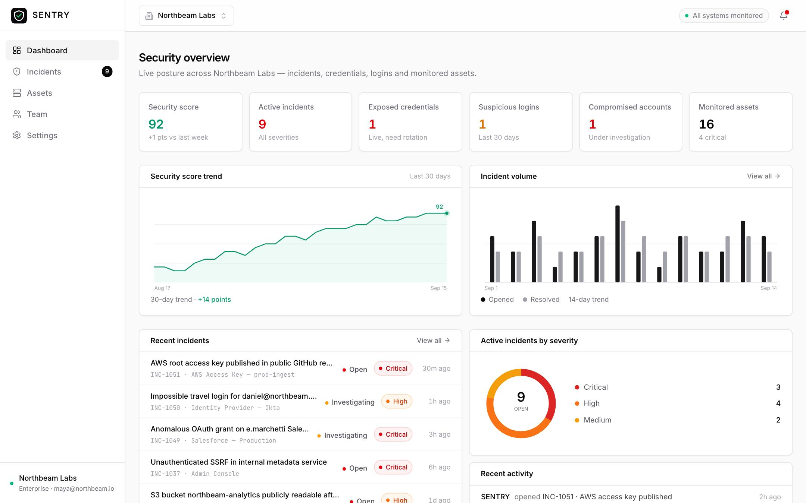

# SENTRY

**Security infrastructure for modern teams.**

A portfolio-quality security SaaS concept: a marketing homepage plus a fully
interactive security operations workspace — incidents, assets, team and
settings — built with realistic simulated data.



## Stack

- React 19 + Vite 7 + TypeScript
- React Router 7 (client-side routing)
- Tailwind CSS 4
- Lucide icons
- Custom SVG charts (no chart library)

## Getting started

```bash
npm install
npm run dev      # http://localhost:5173
npm run build    # type-check + production build
npm run preview  # serve the production build
```

## Routes

| Route | Description |
| --- | --- |
| `/` | Marketing homepage — hero, product preview, capabilities, security score, incident/asset/team sections, CTA, footer |
| `/dashboard` | Security overview: KPIs, score trend, incident volume, risk distribution, recent incidents & activity |
| `/incidents` | Incident queue with search, filters, sorting; detail panel with status changes, assignment and timeline (`/incidents/:id` is deep-linkable) |
| `/assets` | Monitored assets (domains, endpoints, API keys, applications) with risk, findings and detail panel (`/assets/:id`) |
| `/team` | Members, role management, suspend/reinstate, invite flow |
| `/settings` | Profile, security, notifications, API keys & webhooks, workspace settings |

## Architecture

```
src/
  data/mock.ts        # realistic seed dataset (users, incidents, assets, …)
  lib/api.ts          # async API client — swap mock bodies for fetch() calls
  lib/store.tsx       # app-wide state + optimistic actions (one provider)
  lib/status.ts       # severity/status/risk/role design tokens
  components/
    ui/               # Button, Badge, Panel, Input, Select, Modal, Drawer, Menu…
    charts/           # ScoreTrend, IncidentTrend, RiskDistribution, ScoreRing
    layout/           # AppShell, Sidebar, TopBar, workspace/notifications/user menus
    incidents/ assets/ landing/
  pages/              # one page component per route
```

### Connecting a real backend

All data flows through `src/lib/api.ts`. Every function is async and mirrors a
REST-shaped call (`getBootstrap`, `updateIncidentStatus`, `assignIncident`,
`inviteMember`, `updateMember`, …). To wire up a real API, replace the mock
bodies with `fetch()` calls — pages and the store don't need to change.

## Demo workspace

The signed-in user is **Maya Chen** (Owner) of the fictional *Northbeam Labs*
workspace. All data is simulated locally; mutations (status changes, invites,
role edits, notifications) persist client-side for the session.

## Utility scripts

```bash
node scripts/smoke.mjs   # headless smoke test: loads every route at 3 viewports
node scripts/shots.mjs   # regenerates screenshots/ (JPEG) for portfolio use
```

Both require the dev server running on `localhost:5173` and local Chrome.
